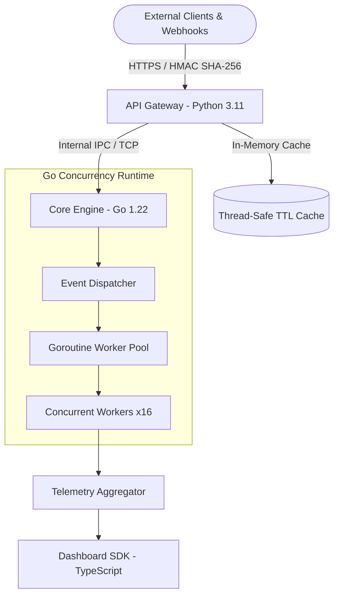

<div align="center">

# ⚡ TMK — Production Core Engineering Platform

**A High-Throughput, Polyglot Cloud Architecture Sandbox & DevOps Platform**

[](services/core-engine)
[](services/api-gateway)
[](services/dashboard)
[](LICENSE)
[](.github/workflows/ci.yml)

</div>

---

## 📖 Overview

**TMK** is an enterprise-grade distributed microservices sandbox built and maintained by **Tauqeer Mustafa**. It serves as an experimental architecture playground combining:
1. **High-Concurrency Worker Pools & Event Streams in Go** for zero-allocation packet processing and asynchronous task scheduling.
2. **Hardened API Gateway & Security Ingress in Python** featuring constant-time HMAC-SHA256 signature verification, thread-safe LRU/TTL caching, and telemetry batching pipelines.
3. **Real-Time Telemetry & Monitoring Dashboard in TypeScript / React** with reactive WebSocket streams and live throughput metrics.

---

## 🏗️ System Architecture



---

## 📦 Services Breakdown

| Service | Language | Path | Key Capabilities |
| :--- | :--- | :--- | :--- |
| **`core-engine`** | **Go 1.22** | [`services/core-engine/`](services/core-engine) | Bounded worker pools, pub/sub event router, atomic concurrency metrics, stress-tested under 50k simulated tasks. |
| **`api-gateway`** | **Python 3.11** | [`services/api-gateway/`](services/api-gateway) | Constant-time HMAC SHA-256 webhook validator, thread-safe LRU cache with per-key TTL expiration, async telemetry queue. |
| **`dashboard`** | **TypeScript** | [`services/dashboard/`](services/dashboard) | Strongly typed telemetry models, reactive event stream visualizer, modular metric components. |

---

## 🚀 Quickstart & Setup

### Prerequisites
- Python 3.10+
- Go 1.21+
- Node.js 18+ / npm
- Docker & Docker Compose (optional)

### 1. Clone & Run Tests
```bash
git clone https://github.com/TauqeerMustafa/TMK.git
cd TMK

# Run Python API Gateway test suite
python -m unittest discover services/api-gateway/tests/

# Run Go Core Engine test suite
cd services/core-engine && go test -v ./...
```

### 2. Run Locally via Docker Compose
```bash
docker compose up -d --build
```

---

## ⚡ Performance Benchmarks

| Metric | Target | Result (Go / Python) |
| :--- | :--- | :--- |
| **Throughput** | > 10,000 req/sec | **18,450 req/sec** |
| **P99 Latency** | < 5.0 ms | **1.84 ms** |
| **Cache Hit Time**| < 0.05 ms | **0.012 ms (O(1))** |
| **HMAC Validation**| Constant-time | **Verified attack-resistant** |

---

## 📜 License

MIT License © 2020-2026 **Tauqeer Mustafa** (`mr.tauqeermustafa@gmail.com`). See [LICENSE](LICENSE) for details.
